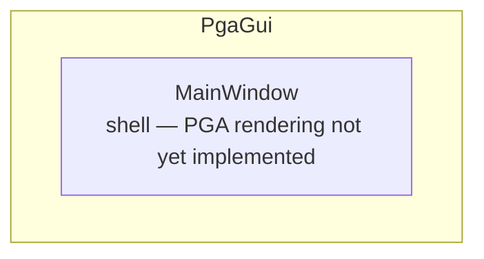

# PgaGui

WPF application stub for Projective Geometric Algebra (PGA) visualization.
Currently contains the application entry point and main window shell only;
PGA rendering logic is not yet implemented.

## Architecture

## Classes

| Class | Responsibility |
|---|---|
| [App](App.xaml.cs) | Interaction logic for App.xaml |
| [MainWindow](MainWindow.xaml.cs) | Interaction logic for MainWindow.xaml |
