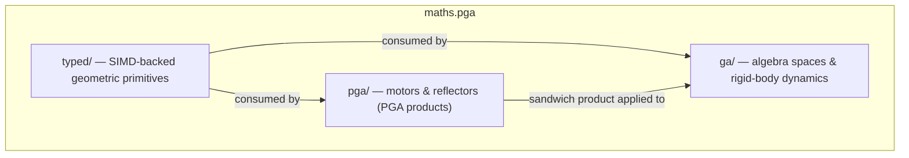

# maths.pga

A C# library implementing Projective Geometric Algebra (PGA) for 2D and 3D rigid-body
simulation, coordinate transformations, and geometric computation.
PGA unifies points, lines, planes, motors (screw motions), and reflections in a single
algebraic framework, eliminating the gimbal lock and singularities of Euler angles
while delivering hardware-accelerated, allocation-free arithmetic on .NET SIMD types.

## Quick Start

| Step | Command |
|---|---|
| Build | `dotnet build maths.pga.csproj` |
| Test | `dotnet test` |
| Run | `dotnet run` |

## Dependencies

### Project References

- [SpocWeb.IMaths](../SpocWeb.IMaths/ReadMe.md)
- [SpocWeb.interfaces](../SpocWeb.interfaces/ReadMe.md)

### NuGet Packages

- `NUnit`

## Architecture

## Subsystems

| Folder | Domain Role |
|---|---|
| [`ga/`](ga/ReadMe.md) | Concrete implementations of low-dimensional Geometric Algebra spaces (R0,0,1 through R4,1,0) together with rigid-body dynamics and geometric shape representations. |
| [`pga/`](pga/ReadMe.md) | Optimised structs and extension methods implementing 2D and 3D Projective Geometric Algebra (PGA) motors, reflectors, and their products. |
| [`typed/`](typed/ReadMe.md) | Strongly-typed, hardware-accelerated geometric primitives for 2D and 3D Projective Geometric Algebra (PGA). |

## Key Concepts

| Term | Definition |
|---|---|
| Multi-vector | An element of a geometric algebra combining scalar, vector, bivector, … and pseudoscalar grades. |
| Motor | Even-grade multi-vector encoding a rigid-body screw motion (rotation + translation); stored as `Motor3P` / `Motor2P`. |
| Reflector | Odd-grade multi-vector encoding reflections in planes and points; stored as `Reflector3P` / `Reflector2P`. |
| Sandwich product | `~M * X * M` — applies motor M to geometric object X; coordinate-free and grade-preserving. |
| BiVector | Grade-2 element representing an oriented plane (3D) or line (2D); stored as `BiVector3D` / `BiVector4D`. |
| TriVector | Grade-3 element representing a 3D plane in homogeneous coordinates; stored as `TriVector4D`. |
| Cayley table | Precomputed sign tables encoding the product rules of a specific algebra signature R(p,q,r). |

## Further Reading

| Document | Purpose |
|---|---|
| `typed/README.md` | SIMD-backed primitive types (Vector2D, Point3D, BiVector4D, …). |
| `pga/README.md` | Motor and reflector algebra; sandwich product; geometric products. |
| `ga/README.md` | Algebra space implementations (R001…R410) and rigid-body physics. |

## Classes

| Class | Responsibility |
|---|---|
| [XGeoGebra](AGeoGebra.cs) | Extension Methods and Tests for IGeoGebra and PGA Classes |
| [AGeoGebra](AGeoGebra.cs) | Abstract Base Class for Multi-Vector-Spaces |
| [AGeoGebraDbl](AGeoGebraDbl.cs) | Abstract Base Class for Multi-Vector-Spaces |
| [IGeoGebra](IGeoGebra.cs) | GA define several Products that transform its 2^n Dimensions into each other, described by Cayley Tables. |
| [XGeoGebra](IGeoGebra.cs) | Extension Methods for IGeoGebra. |
| [XPGA3D](pga3d.cs) | Static extension and utility methods for the PGA3D G(3,0,1) multivector type. |
| [PGA3D](pga3d.cs) | Pga3D Projective Geometric Algebra in 3D, also known as 3D PGA,  extends geometric algebra to include projective geometry. |
| [Program](Program.cs) | Entry point for the PGA demo/test runner. |
| [xPermute](xPermute.cs) | Extension methods for generating all permutations of a list in-place via Heap's algorithm, yielding each permutation together with its parity sign. |
