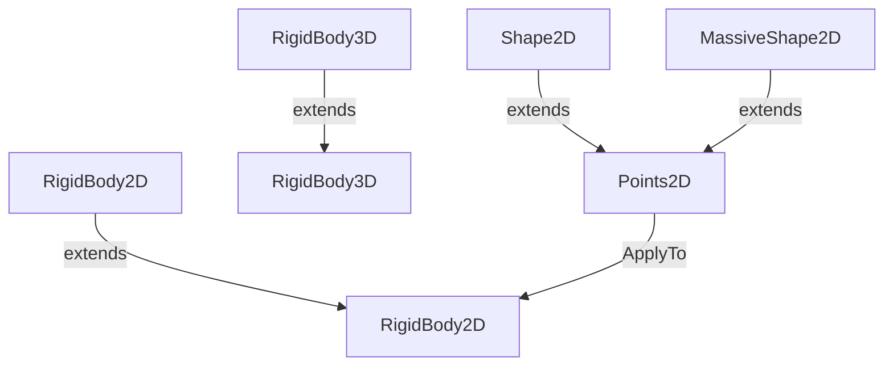

# ga

Concrete implementations of low-dimensional Geometric Algebra spaces (R0,0,1 through
R4,1,0) together with rigid-body dynamics and geometric shape representations.

Each `R{p}{q}{r}` class encodes a specific metric signature and contains the full
Cayley table for all products (outer, geometric, inner, dual) as static data,
allowing generic code in `AGeoGebra{N}<T>` to compute any product by table lookup.

The rigid-body and shape classes build on top of these algebras to model 2D and 3D
physics objects with mass, inertia, position, and attitude.

## Classes

| Class | Responsibility |
|---|---|
| [AGeoGebra16](AGeoGebra16.cs) | Abstract base for a 4D Clifford algebra G(p,q,r) with DIM=4 and 2⁴=16 components,  used for e.g. |
| [AGeoGebra2](AGeoGebra2.cs) | Abstract base for a 1D Clifford algebra G(p,q,r) with DIM=1 and 2¹=2 components (scalar + one basis blade), used by R001, R010, R100. |
| [AGeoGebra32](AGeoGebra32.cs) | Abstract base for a 5D Clifford algebra G(p,q,r) with DIM=5 and 2⁵=32 components,  used for e.g. |
| [AGeoGebra4](AGeoGebra4.cs) | Abstract base for a 2D Clifford algebra G(p,q,r) with DIM=2 and 2²=4 components, used by e.g. |
| [AGeoGebra8](AGeoGebra8.cs) | R^3 Vector-Space with Rotations and Reflections |
| [AGeoGebra8Dbl](AGeoGebra8Dbl.cs) | R^3 Vector-Space with Rotations and Reflections |
| [Pga2Dbl](Pga2Dbl.cs) | Abstract double-precision base for the 8-component multi-vector of G(2,0,1)  (2D Projective Geometric Algebra), shared by Pga2Dbl. |
| [R001](R001.cs) | 1D  Dual/Projective Numbers : Translation only |
| [Base](R001.cs) | Base-Blades in 3D, usable as Indices for Components |
| [R010](R010.cs) | Real + Imaginary Complex Number Algebra with (E1 = I)�=-1: Rotation only |
| [Base](R010.cs) | Base-Blades in 3D, usable as Indices for Components |
| [XR011](R011.cs) | Static extension and test methods for the R011 G(0,1,1) Dual-Complex Number algebra. |
| [R011](R011.cs) | G(0,1,1) Dual-Complex Number algebra with E1²=−1 (rotation/imaginary) and E0²=0 (translation/dual). |
| [Base](R011.cs) | Base-Blades in 3D, usable as Indices for Components |
| [R100](R100.cs) | 1D  Hyperbolic Numbers : Boosting only |
| [Base](R100.cs) | Base-Blades in 1D, usable as Indices for Components |
| [R110](R110.cs) | G(1,1,0) Split-Complex (Hyperbolic) Number algebra with e1²=+1 (real) and e2²=−1 (imaginary). |
| [Base](R110.cs) | Base-Blades in 3D, usable as Indices for Components |
| [R200](R200.cs) | 2D Geometric Algebra: only Rotations |
| [Base](R200.cs) | Base-Blades in 3D, usable as Indices for Components |
| [R300](R300.cs) | 'Ordinary' Vector Space, representing only Vectors/Directions R�, not Points like G�. |
| [Base](R300.cs) | Base-Blades in 3D, usable as Indices for Components |
| [R310](R310.cs) | R310 AKA 2D CGA (Conformal Geometric Algebra) R^4 Relativistic Vector-Space with Rotations and Reflections |
| [Base](R310.cs) | Base-Blades in 3D, usable as Indices for Components |
| [R410](R410.cs) | 5D CGA (3D Conformal Geometric Algebra) with Line, Circle, Plane and Sphere Primitives |
| [Base](R410.cs) | 32 = 2^5 Base-Blades in 4+1D, usable as Indices for Components |
| [RigidBody2D](RigidBody2D.cs) | A RigidBody2D that carries a typed identity payload   for association with a game object or scene node. |
| [RigidBody2D](RigidBody2D.cs) | A rigid Body in 2D has 3 DoF(Degrees of Freedom): 2 for Position and 1 for Attitude/Rotation Angle |
| [RigidBody3D](RigidBody3D.cs) | A RigidBody3D that carries a typed identity payload   for association with a game object or scene node. |
| [RigidBody3D](RigidBody3D.cs) | A rigid Body in 3D has 6 DoF(Degrees of Freedom): 3 for Position and 3 in Attitude |
| [Points2D](Shape2D.cs) | Shape adds Geometry to RigidBody2D |
| [Shape2D](Shape2D.cs) | Shape adds Geometry to RigidBody2D |
| [MassiveShape2D](Shape2D.cs) | Shape with Mass Distribution, total Mass and Inertia |
| [Points3D](Shape3D.cs) | Shape adds Geometry to RigidBody3D |
| [Shape3D](Shape3D.cs) | Shape adds Geometry to RigidBody3D |
| [MassiveShape3D](Shape3D.cs) | Shape with Mass Distribution, total Mass and Inertia |
| [XR1](XR1.cs) | Static Methods for Algebras generated from R^1 Vector-Spaces |
| [XR200](XR200.cs) | R^3 Vector-Space with Rotations and Reflections |
| [XR300](XR300.cs) | R^3 Vector-Space with Rotations and Reflections |
| [XR300Dbl](XR300Dbl.cs) | R^3 Vector-Space with Rotations and Reflections |
| [XR310](XR310.cs) | Static extension and utility methods for the R310 G(3,1,0) SpaceTime / 2D Conformal Geometric Algebra multivector type. |
| [XR310](XR310.Tests.cs) | Tests for x R310. |
| [XR410](XR410.Tests.cs) | Static test and utility methods for the R410 G(4,1,0) 3D Conformal Geometric Algebra multivector type. |

## Relationships

## Entry Points

| Method | Description |
|---|---|
| `RigidBody2D.Move(double dt)` | Integrates velocity and rotation for one time step. |
| `RigidBody3D.Move(float dt)` | Integrates velocity and rotation for one time step in 3D. |
| `Points2D.ApplyTo(RigidBody2D)` | Transforms shape points into world space. |
