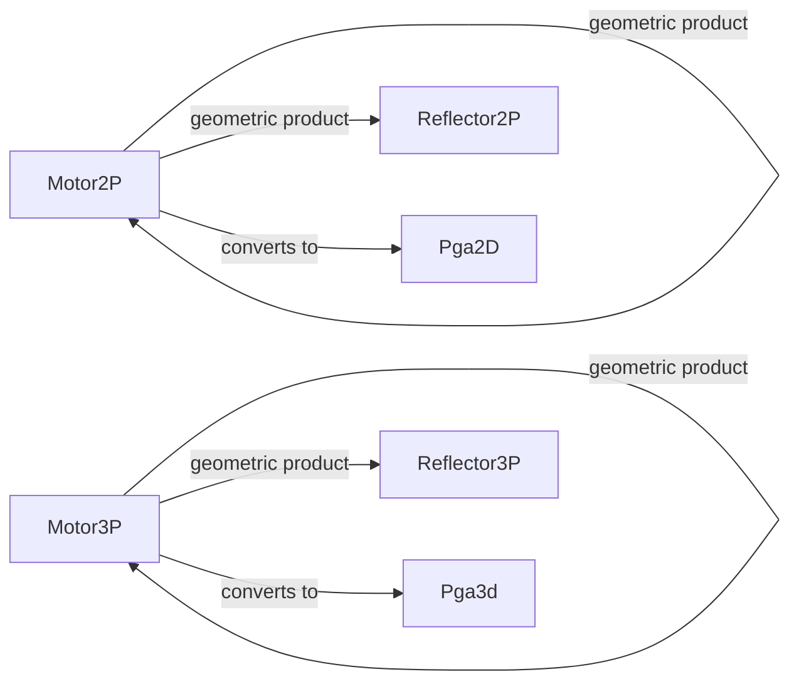

# pga

Optimised structs and extension methods implementing 2D and 3D Projective Geometric
Algebra (PGA) motors, reflectors, and their products.

A *motor* encodes any rigid-body transformation (rotation + translation) as a single
geometric number in the even sub-algebra of PGA.
A *reflector* encodes the odd sub-algebra elements (planes and points).
Composing motors via the geometric product and applying them via the *sandwich product*
is the fundamental computation in this folder.

The 2P suffix denotes the 2D algebra G(2,0,1) and 3P the 3D algebra G(3,0,1).

## Classes

| Class | Responsibility |
|---|---|
| [HyperOperation](HyperOperation.cs) | Hyper-operations are an infinite Sequence of binary Operations building upon each other. |
| [Motor2P](Motor2P.cs) | Even sub-algebra of Pga2D G(2,0,1) encoding 2D rigid-body transformations (rotation around Z and translation in X/Y) as a PGA Motor. |
| [Motor3P](Motor3P.cs) | AKA Motor/Trafo; 3D Projective Transformations; Even Sub-Algebra of Pga3D representing only Motors |
| [Pga2D](Pga2D.cs) | R201 = 2D+€ PGA (Euclidean Plane-based projective Geometric Algebra) |
| [Make](Pga2D.cs) | Factory methods for constructing canonical Pga2D geometric objects (points and lines). / Factory methods for constructing geometric primitives (points, lines) in 2D double-precision PGA. / Static Factory Methods / Factory methods for constructing conformal primitives (points, planes, spheres, circles) in the R311 algebra. |
| [Points](Pga2D.cs) | BiVectors in projective 2D are Points / Bi-Vectors in projective 2D are Points. / Grade3: Static Axes for Point |
| [Lines](Pga2D.cs) | Vectors in projective 2D are Lines |
| [Base](Pga2D.cs) | Base-Blades in 3D, usable as Indices for Components |
| [AxisTrans](Pga2D.cs) | 'Ideal' Axes for Translator/Motor / Grade2: 'Ideal' Axes for Translator/Motor |
| [AxisRot](Pga2D.cs) | euclidean Axes for Rotor / Euclidean rotation axes for Rotor. / Grade2: euclidean Axes for Rotor |
| [Geo](Pga2D.cs) | Polar Coordinates match projective Geometry |
| [Bases](Pga2D.cs) | Bits for each non-zero Component of a Multi-Vector |
| [Types](Pga2D.cs) | Flags classifying which geometric roles a Pga2D multivector's nonzero components play. / Geometric type flags classifying which grade components a multi-vector contains. / Components Types |
| [Pga2Dbl](Pga2Dbl.cs) | R201 = 2D+€ PGA (Euclidean Plane-based projective Geometric Algebra) |
| [Pga3D](Pga3d.cs) | R301 = 3D+€ PGA (Euclidean Plane-Based Geometric Algebra) |
| [Planes](Pga3d.cs) | Grade 1: Static Planes |
| [R311](R311.cs) | Conformal Geometric Algebra with e0� = 0 and eN�=-1 |
| [Reflector2P](Reflector2P.cs) | 2D Projective Algebra Reflector Components: 3 Lines + Z Scale |
| [Reflector3P](Reflector3P.cs) | 3D Projective Algebra Odd/Reflector Components: Planes and Points (2*4*float) |
| [XMotor2P](XMotor2P.cs) | Extension methods for Motor2P and Reflector2P implementing the 2D PGA geometric, sandwich, and conversion products. |
| [XMotor3P](XMotor3P.cs) | Extension methods for Motor3P and Reflector3P implementing the 3D PGA geometric, sandwich, conversion, and inertia-mapping products. |
| [XPga2D](XPga2D.cs) | Extension Methods on IReadOnlyList |
| [XPga3D](XPga3D.cs) | Extension Methods on IReadOnlyList |
| [XR311](XR311.cs) | Extension methods providing geometric, inner, and outer products plus utilities for the R311 conformal geometric algebra. |
| [XR311Dbl](XR311Dbl.cs) | Double-precision extension methods providing geometric, inner, and outer products plus utilities for the R311 conformal geometric algebra. |

## Relationships

## Entry Points

| Method | Description |
|---|---|
| `Motor2P.Sandwich(Motor2P)` | Applies this 2D transformation to another motor (sandwich product). |
| `Motor3P.Sandwich(Motor3P)` | Applies this 3D transformation to another motor (sandwich product). |
| `XMotor2P.Times(Motor2P, Motor2P)` | Full 2D PGA geometric product. |
| `XMotor3P.Times(Motor3P, Motor3P)` | Full 3D PGA geometric product. |
| `Motor3P.Equals(Motor3P)` | Approximate equality check for transformation comparison. |
