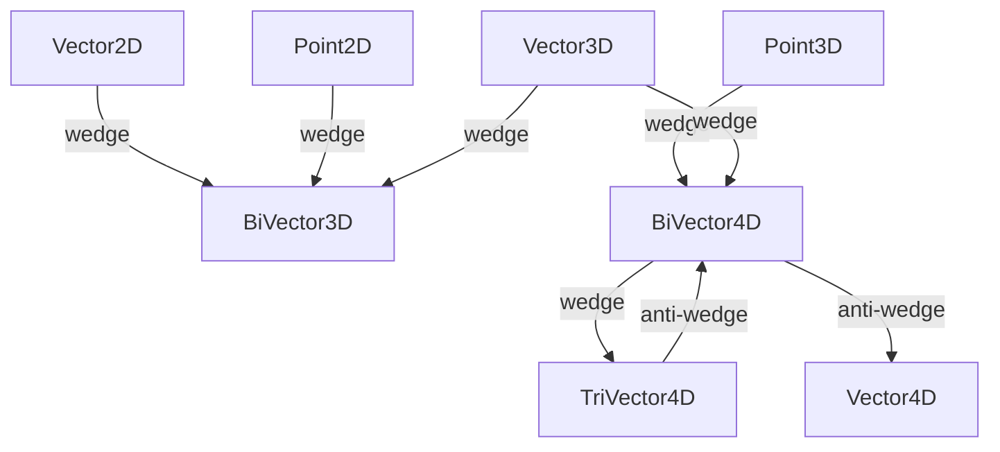

# typed

Strongly-typed, hardware-accelerated geometric primitives for 2D and 3D Projective
Geometric Algebra (PGA).
Each struct wraps a `System.Numerics` SIMD vector (`Vector2`, `Vector3`, or `Vector4`)
to deliver cache-friendly, allocation-free arithmetic on the hot paths of simulation
and rendering code.

The types distinguish *directions* (zero W component, can be added/scaled) from
*points* (W = 1, affine position), and *bivectors* (oriented planes or lines) from
plain vectors, encoding the PGA grade structure directly in the C# type system.

## Classes

| Class | Responsibility | Key Collaborators |
|---|---|---|
| [BiVector3D](BiVector3D.cs) | three floating-point components named x, y, and z of the Cross-Product |  |
| [XBiVector3D](BiVector3D.cs) | Extension methods for BiVector3D and related vector types. |  |
| [XBiVector4D](BiVector4D.cs) | Static factory methods constructing BiVector4D lines via wedge products of homogeneous 3D points and direction vectors. |  |
| [BiVector4D](BiVector4D.cs) | Represents a line in 3D projective space via six Plücker coordinates: a Direction (vector part) and a Moment (bivector part). |  |
| [PerspectiveTransform](PerspectiveTransform.cs) | Given four source and four destination points, it will compute the transformation implied between them. |  |
| [PerspectiveTransformTests](PerspectiveTransformTests.cs) | Tests for perspective Transform. |  |
| [Point2D](Point2D.cs) | Vector2-backed immutable 2D affine point with homogeneous W = 1, supporting addition/subtraction with Vector2D and wedge products that produce lines. / AKA Position2D; Immutable, lightweight, double-Precision, typed Position2D to avoid accidental Type Mix in Arithmetic |  |
| [XPoint2DList](Point2D.T.cs) | Closest-pair algorithms and utility extensions for Point2D lists. | `Segment2D` |
| [TriangleStrip2D](Point2D.T.cs) | A List of Points to be interpreted as a List of Triangles connected to each other |  |
| [Point2DList](Point2D.T.cs) | Allows for comfortable Declaration of ordered Lists and Polygons |  |
| [Size2Dbl](Point2Dbl.cs) | AKA Vector2Dbl; 2D double-Precision, Platform-neutral Pendant to Size; this is a Vector like the hardware-accelerated Vector |  |
| [XSize2Dbl](Point2Dbl.cs) | Extension Methods with Size2Dbl |  |
| [Point2Dbl](Point2Dbl.cs) | Immutable, lightweight, single-Precision Pendant to System.Drawing.Point and Vector2 |  |
| [Rect2Dbl](Point2Dbl.cs) | Platform-neutral Pendant to System.Drawing.Rectangle |  |
| [XPoint2Dbl](Point2Dbl.cs) | Extension methods for Point2Dbl and related 2D types. |  |
| [Point3D](Point3D.cs) | 3D Point accelerated by Vector3 / Typed Position3D Vector3D to avoid accidental Type Mix |  |
| [TriangleStrip3D](Point3D.T.cs) | A List of Points to be interpreted as a List of Triangles connected to each other |  |
| [Point3DList](Point3D.T.cs) | Allows for comfortable Declaration of ordered Lists and Polygons |  |
| [Point3Dbl](Point3Dbl.T.cs) | AKA Position/Location; Typed, double-precision Position3D Vector3D to avoid accidental Type Mix |  |
| [Point4DList](Point4D.T.cs) | Allows for comfortable Declaration of ordered Lists and Polygons |  |
| [Point4D](Point4D.T.cs) | Typed Position3D Vector4D to avoid accidental Type Mix |  |
| [Point4Dbl](Point4Dbl.T.cs) | Typed Position2D Vector2D to avoid accidental Type Mix |  |
| [Segment2D](Segment2D.cs) | AKA Slice2D; Lightweight passive 2D segment Pair (Offset/Length resp Start/End or StartPos/StoppPos). |  |
| [Segment3D](Segment3D.cs) | Lightweight passive Space segment (Offset/Length pair). |  |
| [TriVector4D](TriVector4D.cs) | 4D tri-vector having floating-point components x, y, z, and w. |  |
| [XVector2](Vector2D.cs) | Provides extension methods for Complex. |  |
| [Vector2D](Vector2D.cs) | Vector2-backed struct impl. up to IVector4D |  |
| [Vector3D](Vector3D.cs) | Vector3-backed immutable 3D direction vector that implements IVector4D with W = 0, supporting rotations, projection, rejection, and standard arithmetic. |  |
| [Vector4D](Vector4D.cs) | single-precision Point-/Place-Vector in 3D, used for (Position-)Vectors in homogeneous Coordinates |  |

## Relationships

## Entry Points

| Method | Description |
|---|---|
| `Point2D ^ Point2D` | Wedge product giving the 2D line through two points. |
| `Point3D ^ Point3D` | Wedge product giving the 3D line through two points. |
| `BiVector4D.Project(Point3D, BiVector4D)` | Projects a point onto a unitized line. |
| `TriVector4D.Unitize()` | Normalises a plane to unit weight. |
| `Vector2D.CosSin(float)` | Creates a unit direction from an angle in radians. |
