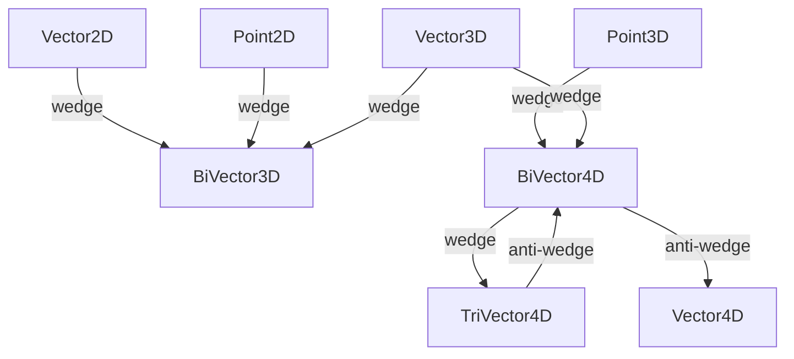

# typed

Strongly-typed, hardware-accelerated geometric primitives for 2D and 3D Projective
Geometric Algebra (PGA).
Each struct wraps a `System.Numerics` SIMD vector (`Vector2`, `Vector3`, or `Vector4`)
to deliver cache-friendly, allocation-free arithmetic on the hot paths of simulation
and rendering code.

The types distinguish *directions* (zero W component, can be added/scaled) from
*points* (W = 1, affine position), and *bivectors* (oriented planes or lines) from
plain vectors, encoding the PGA grade structure directly in the C# type system.

## Classes

| Class | Responsibility |
|---|---|
| [BiVector3D](BiVector3D.cs) | three floating-point components named x, y, and z of the Cross-Product |
| [XBiVector3D](BiVector3D.cs) | Extension methods for BiVector3D and related vector types. |
| [XBiVector4D](BiVector4D.cs) | Static factory methods constructing BiVector4D lines via wedge products of homogeneous 3D points and direction vectors. |
| [BiVector4D](BiVector4D.cs) | Represents a line in 3D projective space via six Plücker coordinates:  a Direction (vector part) and a Moment (bivector part). |
| [Point2D](Point2D.cs) | Vector2-backed immutable 2D affine point with homogeneous W = 1,  supporting addition/subtraction with Vector2D and wedge products that produce lines. |
| [Point3D](Point3D.cs) | 3D Point accelerated by Vector3 |
| [TriVector4D](TriVector4D.cs) | 4D tri-vector having floating-point components x, y, z, and w. |
| [XVector2](Vector2D.cs) | Provides extension methods for Complex. |
| [Vector2D](Vector2D.cs) | Vector2-backed struct impl. |
| [Vector3D](Vector3D.cs) | Vector3-backed immutable 3D direction vector that implements IVector4D with W = 0, supporting rotations, projection, rejection, and standard arithmetic. |
| [Vector4D](Vector4D.cs) | single-precision Point-/Place-Vector in 3D, used for (Position-)Vectors in homogeneous Coordinates |

## Relationships

## Entry Points

| Method | Description |
|---|---|
| `Point2D ^ Point2D` | Wedge product giving the 2D line through two points. |
| `Point3D ^ Point3D` | Wedge product giving the 3D line through two points. |
| `BiVector4D.Project(Point3D, BiVector4D)` | Projects a point onto a unitized line. |
| `TriVector4D.Unitize()` | Normalises a plane to unit weight. |
| `Vector2D.CosSin(float)` | Creates a unit direction from an angle in radians. |
